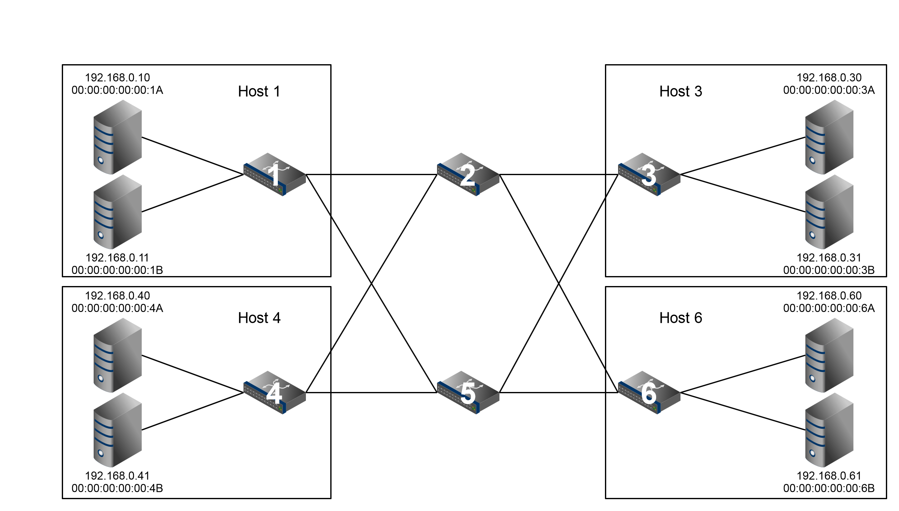

# SoftwareControlledNetwork

The repository contains a Ryu-SDN controller based python code, inserting flows into Dataplane switches to grant connectivity between hosts across data-plane switches, based on Ethernet and VLAN protocol.

The repository contains 3 separate python code files, which use Ryu-SDN controller based python code, inserting flows into Dataplane switches to grant connectivity between hosts across data-plane switches, based on Ethernet and VLAN protocol.

## Network layout

## Sytem setup
The network consists of 4 hosts, each running 2 VMs and a total of 6 OpenvSwitches, which are managed via an SDN controller. 2 out of the 6 switches are labeled as physical switches, whereas the remaining 4 switches are access switches. An access switch is a virtual switch hosted within a host to interconnect the two of its own VMs.

You can use any set of tools to implement the above network setup. For example, using Mininet, or by using Linux namespaces or LXC containers etc. alongwith OpenvSwitch.

## How to run the code
ryu-manager <file.py>

## How to test the code
First part can be tested by simple ping between hosts.
#### For 'L2_SDNcontrolled_RESTbased_vlan.py'
We present two REST queries below to put the hosts 1A and 3A under same VLAN-ID

curl -H "Content-Type: application/json" -X PUT -d '{"vlan":10}' http://localhost:8080/task2/port/1A
curl -H "Content-Type: application/json" -X PUT -d '{"vlan":10}' http://localhost:8080/task2/port/3A

The above commands are executed by REST-API that is part of 'l2_SDNcontrolled_RESTbased_vlan.py' to assign/remove/manage VLAN tags to individual VMs.

#### For 'L2toL4_Firewalling_viaSDN_RESTAPI.py'
We present two sample REST queries enforcing Firewall rules in dataplane switches.

1) To block traffic from sent by ethernet source address of host-1b
curl -H "Content-Type: application/json" -X POST -d '{"name":"1B", "in_port":2, "description":"SomeRule", "priority":"10", "eth_src":"00:00:00:00:00:1b", "action":"drop"}' http://localhost:8080/task3/rules

2) To block traffic initiating from VM '1a' to VM '3a' at IPv4 level.
curl -H "Content-Type: application/json" -X POST -d '{"name":"1A", "in_port":1, "description":"SomeRule", "priority":"10", "ipv4_src":"192.168.0.10", "ipv4_dst":"192.168.0.30", "action":"drop"}' http://localhost:8080/task3/rules
